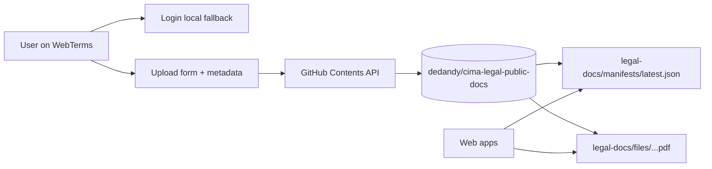

# Public Repo Publication Blueprint (Current)

## Goal
Use `webterms` without a dedicated backend publisher service, publishing directly to the public GitHub repo.

## Current Topology
- `webterms/frontend`: UI for list/official/upload.
- Public repo: `dedandy/cima-legal-public-docs`.
- No runtime backend for publication.

## End-to-End Flow
1. User opens `Inserimento` page.
2. User provides GitHub settings and token (`Contents: write`).
3. User uploads file + metadata (`platform/docType/lang/effectiveDate`).
4. FE reads current manifest from GitHub.
5. FE computes next version (`v###`) and target file path.
6. FE uploads PDF to repo via GitHub API.
7. FE updates `legal-docs/manifests/latest.json` in the same repo.
8. `Documenti` and `Ufficiali` pages read the public manifest URL and show latest entries.

## Canonical Paths
- Manifest: `legal-docs/manifests/latest.json`
- Files: `legal-docs/files/<platform>/<docType>/<lang>/<yyyy-mm-dd>/v###_<original-file-name>.pdf`

## Operational Notes
- Reading public files does not require token.
- Writing requires a GitHub token with write permission on the repo.
- `latest.json` and `publicBaseUrl` are persisted in browser `localStorage`; wrong values can survive repo moves until reset.

## Validation Checklist
- Upload returns `OK: <file> (v###)`.
- Repo contains new file under `legal-docs/files/...`.
- Repo manifest updates under `legal-docs/manifests/latest.json`.
- `Documenti` and `Ufficiali` pages show the new version.

## Decommission Confirmation
Given this flow is active and tested, `cima-legal-publisher-be` is not required for runtime publication and can be archived/deleted.
